:PROPERTIES:
:ID:       68b12a18-458e-4a98-9c52-1df855767cd8
:END:
#+TITLE: Lab on Attacking the Lab -- Solutions
#+AUTHOR: Pierre AYOUB
#+EMAIL: pierre.ayoub@eurecom.fr
#+SETUPFILE: https://raw.githubusercontent.com/fniessen/org-html-themes/master/org/theme-readtheorg.setup

* Warm Up: Listening to Some Interesting Audio

  - Question 1 :: A SDR is a radio transceiver where (de)modulation, filters
    and other components traditionally implemented in analog hardware are
    instead implemented in software running on digital hardware. Thus, it is
    more flexible because a lot of parameters can be changed at runtime.
  - Question 2 :: The frequency range of the RTL-SDR range from 500 kHz up to
    1.75 GHz.

** Listen to Local FM Radio Stations

   - Question 3 :: It is an algorithm (implemented in hardware on a circuit or
     software) used to control the gain of the receiver automatically in order
     to have a constant output level, avoiding saturation, clipping, or too low
     output.
   - Question 4 :: The frequency has to be set to the carrier of an FM station
     (with an offset to avoid DC component). The filter has to match the
     bandwidth of the FM signal, generally between 100 or 200 kHz.
   - Question 5 :: Yes, we can, in a bad quality. The reason is that the signal
     amplitude (which is constant in FM) follows the frequency that is
     currently used by the modulation (which is not constant in FM). The
     frequency shifting left and right on a spectrum, this cause a slightly
     amplitude change (AM) as function of this frequency shift (FM). Thus, the
     AM receiver is able to reconstruct a low-quality signal based on this
     amplitude change.
   
** Listen to Our Transmitter

   - Listen to the [[file:exo1/complex/message.complex][=message.complex=]] file with GQRX, to do so, use the IQ file
     option and set the device string accordingly:
     =file=/full/path/message.complex,freq=433.92e6,rate=192e3,repeat=true,throttle=true=.
     Then set modulation to =WFM (mono)= and the filter width to the entire
     bandwidth of the signal.
   - You must understand =Hello, you are on radio non-sense, 31, 12, 31, 9,
     12=.
   - These numbers corresponds to a secret message in ASCII encrypted with a
     one-time pad encryption scheme.
   - The [[file:exo1/scripts/number_station_rx.py][=number_station_rx.py=]] script can be used to decrypt the message,
     which is: =hello=.
     

   - Question 6 :: This is a number station, a radio station which broadcast
     numbers. Those numbers corresponds to a message, and are often obfuscated
     or encrypted.
   - Question 7 :: The radio carrier is Frequency Modulated (FM).
   - Question 8 :: The original secret message is =hello=, once decrypted with
     the one-time pad.
   - Question 9 :: We can use the squelch function, used to mute a channel when
     there is no activity on it.
   
* Exercise: Reversing the Remote of the Lab's Curtains

** Reconnaissance

   - The resonator is the Epcos R904. Its datasheet can be found on
     [[https://www.chipfind.net/datasheet/pdf/epcos/r904.pdf][ChipFind.net]].

     
   - Question 10 :: The resonator is used to generate the carrier wave that
     will be modulated by the control signal.
   - Question 11 :: The frequency of the carrier is at 433.42 MHz.
   - Question 12 :: Considering the very simple architecture of the remote
     control, it is highly probable that we will have an OOK modulation scheme,
     where the modulation is achieved by simply turning on and off the carrier
     which only needs a transistor acting like a switch.
  
** Using the Universal Radio Hacker (URH) to Reverse the Protocol
   
*** Demodulation (ASK)

    - Open the [[file:exo2/complex/RTL-SDR-433_420MHz-1MSps.complex][=RTL-SDR-433_420MHz-1MSps.complex=]] file in /URH/. You will
      end-up with this, in the =Interpretation= tab:

      #+CAPTION: After opening the complex file, we see 6 packets.
      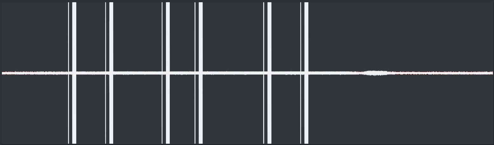

      We see 6 packets, each one composed of a brief pulse at the beginning, then a
      longer one. In our recording, each group of 2 packets corresponds to a
      different button, where each packet correspond to one button press.

    - Zoom into the signal, no matter where. We see that there is no frequency
      change nor amplitude change in our signal, only pulsation (carrier is on or
      off). This is a particular type of ASK (Amplitude Shift Keying), called OOK
      (On-Off Keying):

      #+CAPTION: Zooming into the signal to search the modulation type.
      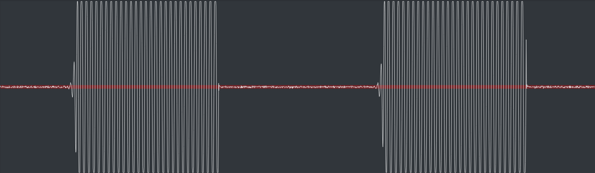

    - Question 13 :: The modulation used is On-Off Keying (OOK).
      

    - We want to search the smallest transmitted symbol in our signal, in order to
      find the symbol length. This is the information unit in our
      transmission. Once we have find one smallest symbol (there are many), we can
      measure it's length with /URH/:

      #+CAPTION: Measuring the length of the smallest symbol.
      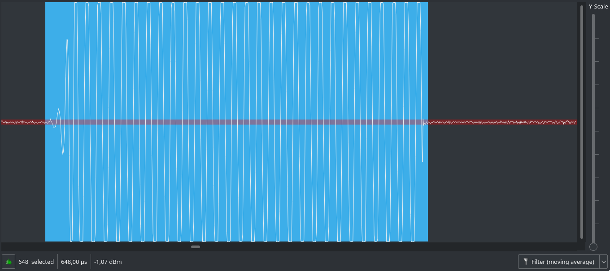

      Here, the symbol length is approximately of 648 samples. Since we have a
      signal sampled at 1 MSps (1 million of samples per second), 648 samples is
      equal to 648 µs (as displayed by URH). If the signal would have been sampled
      to 2 MSps, then the number of samples would have been equal to approximately
      1296, which still corresponds to 648 µs $(\frac{1e6}{2e6 / 1296} = 648)$.

    - Question 14 :: The symbol length in µs is equal to 648 µs.
      

    - Set the parameters into URH. Your must see this:

      #+CAPTION: Result of our demodulated signal.
      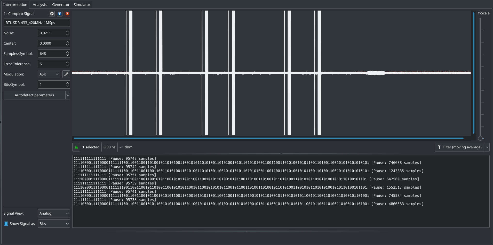

*** Decoding (Manchester-I)

    - No that we have a demodulated message, we will start the analysis of the
      protocol in the =Analysis= tab. At the beginning of each packet, we observe
      that we the short pulses before the long ones are sequences of 17 bit set
      to 1 (=11111111111111111=), taking approximately 10000 ms. They are used to
      wake-up the receiver by sending a preamble message. Since they contain no
      data, we can hide these rows to analyze the protocol.

      We end up with this:

      #+CAPTION: Analysis tab after hiding preamble messages used to wake-up the receiver.
      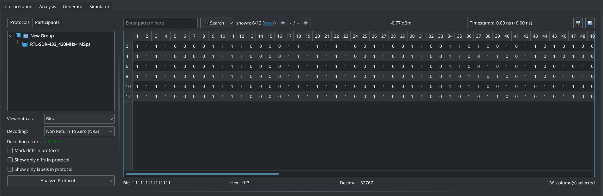

    - We want to find the encoding scheme of the original message. To that, we have
      to know the different line encoding that exists and to look at the message we
      get, comparing it to what we know.

      We enable =Mark diffs in protocol=, and starting from the left of the
      message, we have some sequences of 4 bits set to 1 and 4 bits set to 0
      (=1111000011110000=). Past bit 24 (included), we observe that we never
      see again a sequence of 1 or 0 longer than 2 bits (=11= or
      =00=). Moreover, if we group bits by 2 from bit 25 (included), we only
      obtain groups of =01= and =10=. This strongly suggest a /Manchester
      encoding/. Finally, looking at bits 35 to 40, we observe a counter that
      is incremented, displayed after its encoding by a Manchester code, which
      confirm our guess. In fact, a group of bits equal to =01= (/low-to-high
      transition/) in Manchester code is equal to a logical =1=, and a =10=
      (/high-to-low transition/) equal to a =0=. This is the Manchester
      encoding described in the /IEEE 802.3 norm/ (and not the Manchester
      encoding described previously /G. E. Thomas/), as there is two
      conventions. Thus, for the counter, =1001= encoded is equal to =01=
      decoded, and =0110= is equal to =10= (incremented!), and so on. Since we
      assume that the message is Manchester encoded, then, the sequences of
      =1111= and =0000= at the beginning are invalid. They are used to indicate
      to the receiver the beginning of a packet and synchronize its clock.

      #+CAPTION: We suggest a Manchester encoding and we start to identify the Synchronization and Counter field.
      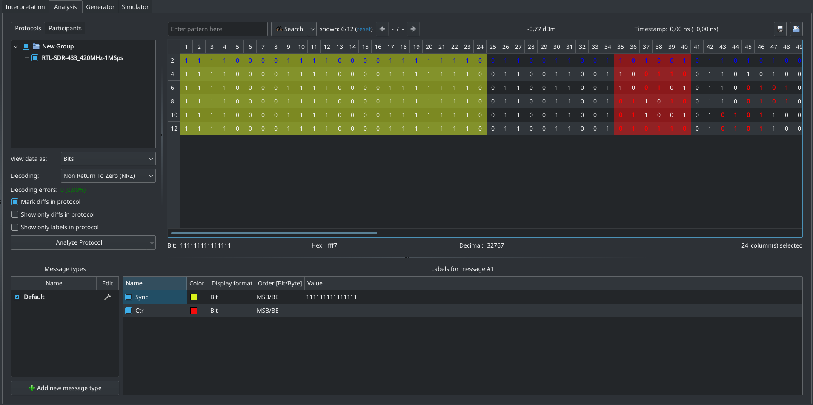

    - Question 15 :: The remote control use the IEEE 802.3 Manchester encoding,
      where a received =01= is equal to a logical =1= and a received =10= is
      equal to a logical =0=.
      

    - To analyze the data, we will have to ignore the Synchronization field
      since it does not contain any real data. To know exactly where the data
      start, we look at our counter, bit 35 to 40. It is highly improbable that
      our counter is only on 3 bits (before Manchester decoding). Lets assume
      that it is on 4 bit (we can confirm that by analyzing more traces), then
      it start at bit 33 (included) and end at bit 40 (included). Then, to
      complete one byte, we have a 4-bit value from bit 25 to bit 32
      (=01100110= in Manchester encoding, =1010= after decoding, corresponding
      to =0xA=).

      #+CAPTION: We identified a Fixed field and the entire Counter field.
      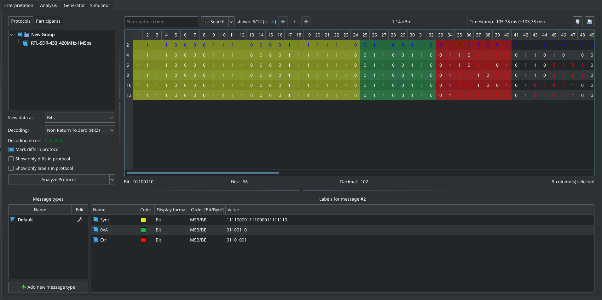

      We will end-up with this message by setting =Decoding= to =Manchester-I=.
      When changing decoding, you will have to set the label manually again, URH
      doesn't do that automatically. We are now ready to analyze the actual data
      of the packet.

      #+CAPTION: We change the encoding for =Manchester-I=. We can now directly see the Counter increment.
      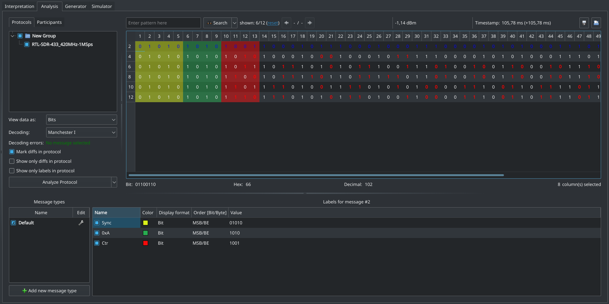

*** Decryption (XOR)

    - Now that we have a decoded message, we have the actual transmitted
      data. However, an encryption layer can still exist on the data, either on
      the entire packet or only on a part of it. In order to reverse the
      protocol, we will speculate on mandatory or possible fields inside the
      message:
      - Synchronization (=Sync=) :: Only relevant for the physical radio layer
        and not for the upper layers.
      - Fixed (=0xA=) :: We already identified a fixed 4-bit field at the
        beginning of every message (=0xA= after decoding).
      - Counter (=Ctr=) :: We already identified a counter at the lowermost 4-bit
        the first byte of the transmitted data. It could be used in an encryption
        process (like a key), or as it to avoid replay attack.
      - Control Code (=Ctrl=) :: Different buttons lives on the remote
        controller, then, a unique fixed code must be sent to the target to
        identify each button separately.
      - Address (=Addr=) :: When we use our own remote controller with our own
        target, we don't want to control the neighbor's target -- at least, the
        manufacturer don't want this. Then, a unique address of our own target
        has to be embedded in the message.
      - Checksum (=Chk=) :: This one is not mandatory, but very common, because
        it's cheap, very easy and useful to check for bad message and correct
        some minor issues.
      - Rolling Code (=RC=) :: In a blink of an eye, we see that there is a lot
        of data which change between each button press, even for the same
        button. This suggest an encrypted rolling code, as we don't see any clear
        pattern yet.

      Other fields could be present in the message. If we at least identify the
      mandatory and the very probable fields cited above, the unknown last fields
      could be deduced later.

    - Question 16 :: We expect to see at least Counter, a Control Code, an
      Address fields, and maybe a Rolling Code, a Checksum, a Synchronization
      fields.
      

    - Continuing from the /Counter/ (=Ctr=) to the right, we observe a 4-bit
      field (bit 14 to 17) which change only when we we change the pressed
      button. This strongly suggest that this field is the /Control Code/
      (=Ctrl=). Since this only take half of the current byte, the next 4 bits
      represent certainly another field, but we have any clue here. Continuing
      analysis from left to right, we then only have bits that flips between
      message without any particular meaning. That suggest that at least the rest
      of the message is encrypted. Currently, we got this:

      #+CAPTION: We identified the Control Code field and delimited other fields for investigation.
      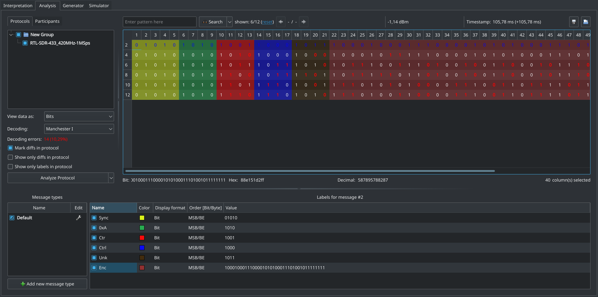

    - At this point, in real life, you would have to do some experiments with the
      packets to understand how the encryption/obfuscation of the message
      works. Here, we don't have enough time in the lab -- so we give two links
      [[https://pushstack.wordpress.com/somfy-rts-protocol/][[1]​]] [[https://pushstack.wordpress.com/2014/04/14/reversing-somfy-rts/][[2]​]] where the reverse engineering and the format of the protocol is
      given. From that, you should be able to understand all the fields and to
      write your own decoder in the next step.

    - URH is powerful enough to decode common used codes, but if there is more
      operation on the transmitter side, like cryptography or obfuscation, URH
      will need some help. Here, common decoders of URH will not be
      sufficient. We can resolve this by using a custom decoding script, which
      is a Python script -- written by ourselves -- that will decode a packet
      and bring its output to URH by the standard output stream. Go to =Edit=,
      =Decoding=, choose =External Program= and click on =Add to Your
      Decoding=. The =Your Decoding= window is a stack of decoding function
      that can be combined to create really advanced decoder. In our case, we
      will only use our own script. In the =Decoder= field, enter the full path
      of the Python script, /e.g./, [[file:exo2/scripts/urh_decoder.py][=/home/wisec/urh_decoder.py=]]. Now, URH will
      send the demodulated data to your script -- in the first argument,
      i.e. src_python[:eval never :exports code]{sys.argv[1]} To quickly test
      the script, you can either try it directly from the shell, or using the
      URH's =Test= field in the =Decoding= window where you can enter a signal
      example and see the output in the =Decoded Bits=.

    - When you have finished to test the decoder, you can use it in URH by
      clicking on =Save as...= and giving a name to it (/e.g./
      =SomfyRTS=). Close the =Decoding= window, and select your just created
      decoder =SomfyRTS= in the =Decoding= field. Beware that the script will
      squash the first 24-bit of the synchronization field, so you will have to
      re-set the URH annotations manually. After that, we end-up with this:

      #+CAPTION: Completely decoded packets with a custom Python script. Beware that we don't have the =Sync= field anymore!
      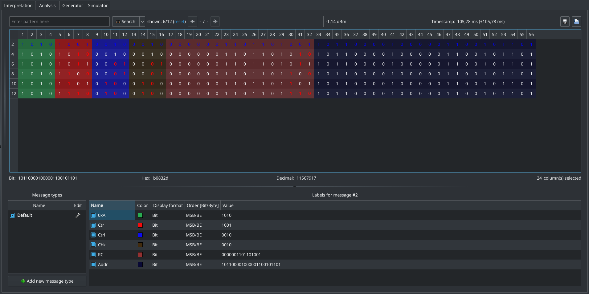

    - Question 17 :: The first message without the first synchronization field
      is: =1010 1001 0010 0010 0000001101101001 101100001000001100101101=
      

    - We can see that the =0xA= is the fixed part of the key, then the =Ctr=
      which is the dynamic part of the key used for the XOR operation. Then we
      observe the =Ctrl= that indicate the pressed button, which is equal for
      two-by-two signals. Then we have the =Chk= that also change only
      two-by-two (because in the Counter field we have two bit flips which
      cancel each other in the Checksum). Finally, we have our =RC= field which
      once decrypted, is just equal to the counter in his lowermost
      bits. Finally, we have the =Addr= field which is constant because we used
      the same remote during all the test.

    - Question 18 :: The XOR provides "Security by obscurity", which is not
      considered as secure by the Kerckhoffs principle.

    - Question 19 :: The purpose of the counter and the rolling code is to
      prevent replay attack. Indeed, if the receiver's counter is not
      synchronized with the transmitted counter, then it will refuse to execute
      the command. Then, the attacker has to guess the counter value or to read
      it by intercepting previous legitimate transmissions.

    - To compute the checksum used by this protocol, one can use the [[file:exo2/scripts/cks.py][=cks.py=]]
      script like this: =./cks.py
      10101010001000000000001101101010101100001000001100101101=. This is a
      Python implementation of the checksum used in this protocol. Simply
      speaking, the checksum used is a XOR of all the bytes of the
      packets. This corresponds to a CRC polynome, that we can find in two way:
      1. *Hardware implementation*: By looking at Figure 1, Page 3 of this
         [[http://ww1.microchip.com/downloads/en/appnotes/00730a.pdf][MicroChip publication]], we can see that the higher order of the
         polynome define the size of the CRC, while the lower order define the
         XOR between the current CRC computation (initialized to 0) and the
         arriving data. Those two are mandatory. The others intermediate order
         define XOR inside the CRC being computed. By this graphical
         demonstration, we easily conclude that XORing all the bytes between
         themselves on a 4-bit value is equivalent to compute a CRC with the
         following polynome: $x^4 + 1$, which is represented by =10001b= or
         =0x1=. Why not =0x17=? Because 4-bit CRCs are the most smallest ones,
         so the $x^4$ term is implicit, then there is only the $x^0 = 1$
         defined by =0x1=.
      2. *Theoretical verification*: On [[https://www.rndtool.info/CRC-step-by-step-calculator/][RNDTool.info]], by setting =CRC
         polynomial as binary sequence= to =10001=, and =Message as binary
         sequence= to
         =10101010001000000000001101101010101100001000001100101101=, and
         looking at =Remainder is:= in the polynomial division, we see that the
         remainder is $x = x^1$. If you look at the LSBs -- =101101= -- of the
         message, that corresponds to the =10= just before the last =1=. And
         indeed, for this message in our protocol, the checksum was =0010=.

    - Now that we know the polynome used by this protocol, we can configure our
      CRC computation into URH, so that it will be computed automatically. To
      do so, one must have a label called =checksum=, then right-click on the
      label in the bottom window, finally click on =Edit...=. Set the =Checksum
      category= to =generic=, the =CRC function= to =Custom=, the =CRC
      polynomial (hex)= to =1=, =Start value (hex)= to =0= and =Final XOR
      (hex)= to =0=. Finally, set =Configure data ranges for CRC= to =1= to
      =12= and =17= to =56=. This tell URH to compute the CRC without using the
      checksum field itself, otherwise URH will compute a remainder of =0= for
      valid packets.

      #+CAPTION: Messages with a valid CRC computation
      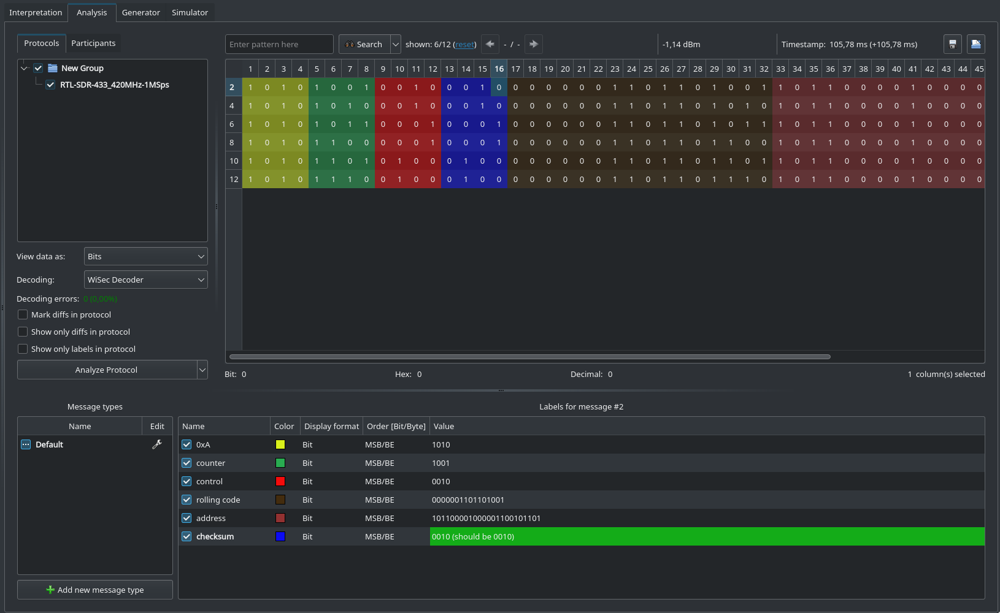

      #+CAPTION: Configuration of the CRC computation
      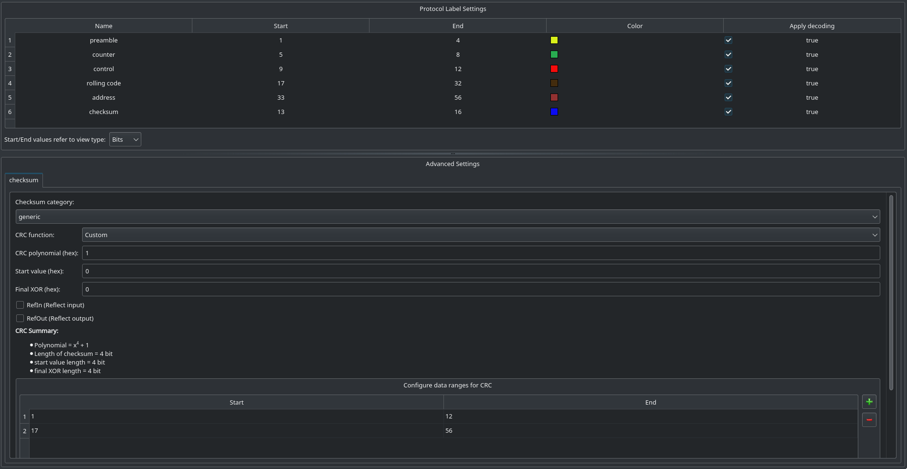
      

    - Question 20 :: A checksum is a code used to identify transmission
      errors. The correction is done by re transmitting the message if an error
      occurred. Different checksum algorithm exists, one of the most simple
      being the Single Parity Bit. The checksum used here is a CRC, with the
      $x^4 + 1$ polynome.

    - Question 21 :: Since there is a protection against replay attack, we
      can't generate an open packet at any time because we need the counter
      information. Thus, we can indeed generate an open command with the last
      valid command, because we can get the counter since we reversed the
      protocol.

    - Question 22 :: If we spoof one legitimate command by sending a crafted
      command, the next legitimate command will be ignored by the curtain since
      it will not be synchronized anymore.

* Bonus: Spoof the Remote by Transmitting an "Open" Command

  - Question 23 :: Steps in URH to spoof a command:
    1. Record a signal of one button press.
    2. Demodulate and decode it.
    3. Add the [[file:exo3/scripts/urh_encoder.py][=urh_encoder.py=]] script into the Encoder path of the Somfy
       Decoding profile.
    4. Go into the Generator tab.
    5. Increment the Counter and the Rolling Code.
    6. Modify the Control Code.
    7. Click on =Edit...= to set the carrier frequency to =433.42M=.
    8. Click on =Send data...=. Set the parameters and send the signal.
    9. The curtains should be hacked.

  #+CAPTION: Spoofed packet
  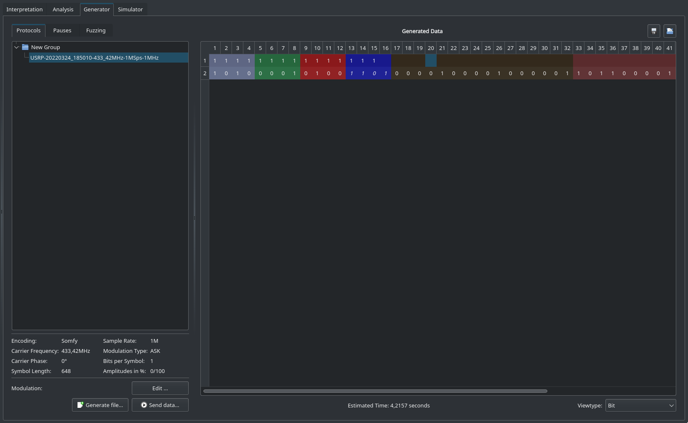

  #+CAPTION: Modulation parameters
  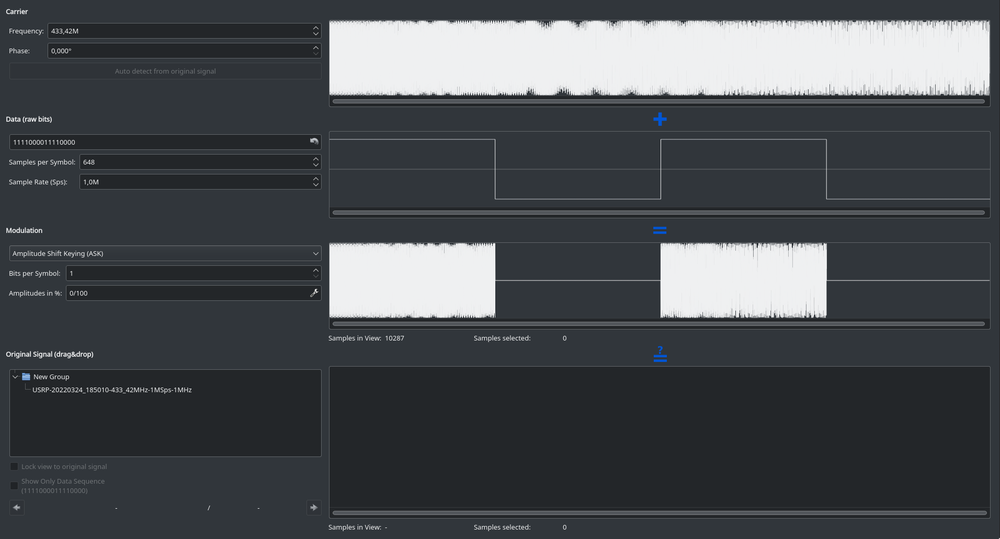

  #+CAPTION: Sending signal window
  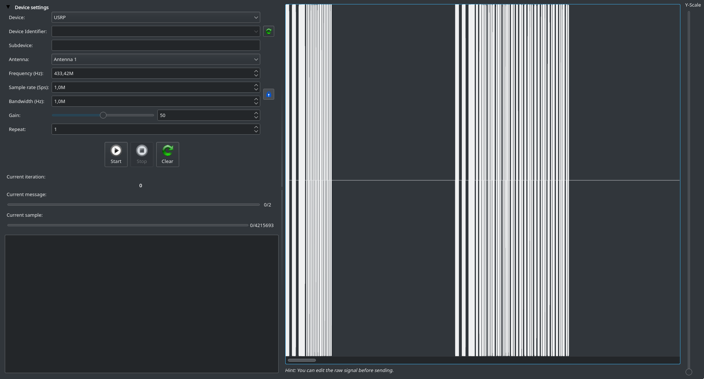

* Bonus: Reversing the Hardware of the Remote

  - Download and launch [[https://support.saleae.com/logic-software/legacy-software/older-software-releases][Salae Logic Analyzer v1]]:
    #+BEGIN_SRC bash :eval never
    wget https://downloads.saleae.com/logic/1.2.40/Logic-1.2.40-Linux.AppImage
    chmod +x ./Logic-1.2.40-Linux.AppImage
    ./Logic-1.2.40-Linux.AppImage
    #+END_SRC
  - Load the [[file:exo4/logicdata/curtains_logic_analyzer.logicdata][=curtains_logic_analyzer.logicdata=]] file by clicking on =Options=
    in the left upper corner, then =Open capture / setup=.
  - First, we clearly see that the buttons control one transistor that itself
    control the radio control signal (meaning the digital signal that control
    the radio carrier emission). But each button has additional circuitry to
    modify this signal individually.
    #+CAPTION: Pressing a button put on the radio
    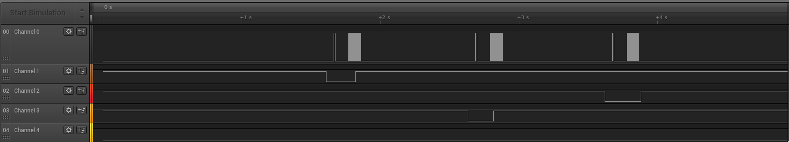
  - In the square wave of the radio control signal, a high voltage means to
    turn the radio carrier on, and a low voltage means to turn the carrier
    off. That is how symbols are generated.
  - Secondly, if we compare two radio control signals between two buttons, we
    observe that the beginning is similar (sync packet and fixed key), bet then
    we have changes in the signal:
    #+CAPTION: Button press 1
    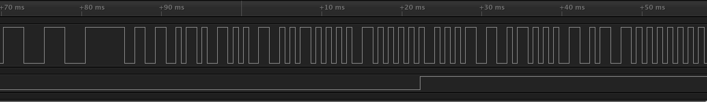
    #+CAPTION: Button press 2
    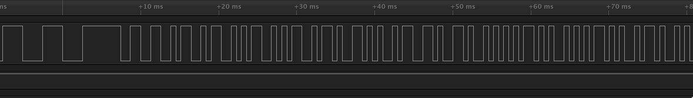
  - Comparing the two pictures, we can identify the counter increment: the
    first peak that is changing is one peak that goes from left (1st press) to
    right (2nd press). Remembering that those peaks encode logical bits in
    Manchester encoding, that means that we have =1010= = =00= in the first
    message, and =1001= = =01= in the second message. We can see two next peaks
    that move from left to right, encoding the control code.

    
  - Question 24 :: This hardware implement the protocol by sending a digital
    signal to a transistor that control the resonator. This signal controls if
    the resonator is able to emit the carrier through the antenna, or not. This
    signal depends on the pressed button. It encodes logical bits with a
    Manchester encoding.
